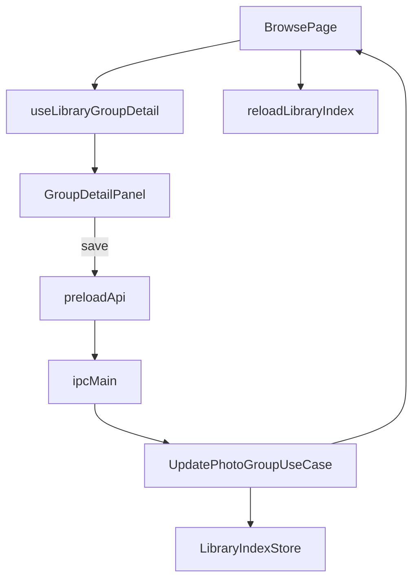

# 03. 그룹 상세 편집 UX 연결 계획

## 목표
- 이미 구현된 그룹 편집 기능을 실제 탐색 플로우에 연결한다.
- 지도 탐색과 파일 목록에서 제목, 동행인, 메모, 대표 사진을 수정할 수 있게 한다.
- 저장 후 현재 선택 컨텍스트를 최대한 유지해 UX 단절을 줄인다.

## 현재 상태 요약
핵심 파일:
- [`src/presentation/renderer/components/GroupDetailPanel.tsx`](C:/workspace/cursor/Photo/src/presentation/renderer/components/GroupDetailPanel.tsx)
- [`src/presentation/renderer/pages/BrowsePage.tsx`](C:/workspace/cursor/Photo/src/presentation/renderer/pages/BrowsePage.tsx)
- [`src/presentation/renderer/components/map/MapPhotoSidebar.tsx`](C:/workspace/cursor/Photo/src/presentation/renderer/components/map/MapPhotoSidebar.tsx)
- [`src/presentation/renderer/pages/FileListPage.tsx`](C:/workspace/cursor/Photo/src/presentation/renderer/pages/FileListPage.tsx)
- [`src/shared/types/preload.ts`](C:/workspace/cursor/Photo/src/shared/types/preload.ts)
- [`src/presentation/electron/preload/api.ts`](C:/workspace/cursor/Photo/src/presentation/electron/preload/api.ts)

관찰:
- `GroupDetailPanel` 은 완성도가 높지만 연결되지 않았다.
- `BrowsePage` 는 지도 + 사이드바 + 프리뷰만 보여준다.
- `MapPhotoSidebar` 는 사진 보기 중심이며 메타 편집 UI 가 없다.
- `FileListPage` 는 현재 그룹 이름 변경만 제공하고, `updatePhotoGroup` 호출 시 동행인/메모를 유지값으로 넘긴다.

## UX 목표 화면

### 우선 연결 위치
1순위:
- `BrowsePage` 우측 패널에 `GroupDetailPanel` 통합

이유:
- 그룹 단위 탐색과 메타 편집이 같은 문맥에서 이어진다.
- 대표 사진 선택과 그룹 이동 기능이 지도 경험과 가장 잘 맞는다.

2순위:
- `FileListPage` 의 그룹 폴더 상세 영역에 축소형 편집 UI 추가

## 제안 레이아웃

### 옵션 A. 지도 우측 패널 2단 분할
- 상단: 현재 `MapPhotoSidebar`
- 하단: `GroupDetailPanel`

장점:
- 기존 구조를 크게 깨지 않는다.
- 사진 미리보기와 메타 편집을 동시에 유지할 수 있다.

단점:
- 세로 공간이 부족할 수 있다.

### 옵션 B. 탭형 패널
- 탭 1: 사진 미리보기
- 탭 2: 그룹 상세 편집

장점:
- 공간 효율이 좋다.
- 복잡한 폼을 안정적으로 담을 수 있다.

단점:
- 편집 발견성이 조금 낮아진다.

권장:
- 1차 구현은 옵션 B
- 이후 필요 시 넓은 화면에서 2단 분할로 확장

## 데이터 흐름 계획

## 구현 계획

### 1. `BrowsePage` 에 편집 상태 추가
필요 상태:
- `isSavingGroup`
- `isMovingGroupPhotos`
- `saveSuccessMessage` 또는 공용 success banner

책임:
- 선택 그룹과 상세 데이터를 `GroupDetailPanel` 에 전달
- 저장/이동 후 `reloadLibraryIndex()` 와 상세 재선택 수행

### 2. `GroupDetailPanel` 실연결
전달할 props:
- `group`
- `allGroups`
- `outputRoot`
- `isSaving`
- `isMovingPhotos`
- `onSave`
- `onMovePhotos`

보완 포인트:
- `allGroups` 타입이 현재 `GroupDetail[]` 기반이라면 실제 연결 시 `GroupSummary` 기반 이동 대상 목록이 더 적합한지 검토
- 저장 버튼과 이동 버튼의 성공 후 상태 초기화 규칙 정리

### 3. 저장 성공 UX 추가
후보:
- 상단 success banner
- 자동 사라지는 간단한 토스트

권장:
- 페이지 내 banner 로 시작

메시지 예시:
- `그룹 메타데이터를 저장했습니다.`
- `선택한 사진을 다른 그룹으로 이동했습니다.`

### 4. 선택 상태 유지 전략
저장 후:
- 같은 `groupId` 가 남아 있으면 재선택 유지
- 대표 사진 변경 시 overlay/selectedPhotoId 는 새 대표 또는 기존 선택을 유지

이동 후:
- 현재 그룹이 비어지면 상위 우선순위 그룹으로 fallback 선택
- 일부 사진만 이동했으면 현재 그룹 유지

### 5. `FileListPage` 의 이름 변경 UX 보완
1차 범위:
- `GroupDetailPanel` 까지 붙이지 않더라도, 향후 편집 진입점 링크 또는 버튼 추가

2차 범위:
- 파일 목록의 상세 패널에서 동일 편집 UI 공유

## 단계별 작업 순서
1. `BrowsePage` 에 편집 패널 배치 방식 도입
2. `updatePhotoGroup` 저장 핸들러 연결
3. `movePhotosToGroup` 이동 핸들러 연결
4. 저장/이동 후 리로드와 선택 상태 복원
5. 성공 메시지 추가
6. `FileListPage` 에 편집 진입점 또는 후속 확장 포인트 정리

## 테스트 계획

### 자동 테스트 후보
- `BrowsePage` 또는 패널 통합 렌더 테스트
- 저장 클릭 시 올바른 IPC payload 전달
- 이동 후 리로드 호출 여부
- 저장 중 버튼 비활성화 여부

현재 테스트 공백:
- 지도/브라우즈 UI 상호작용 테스트가 거의 없다.

### 수동 검증
1. 그룹 제목 수정
2. 동행인 수정
3. 메모 수정
4. 대표 사진 변경
5. 일부 사진을 다른 그룹으로 이동
6. 이동 후 지도 선택/사이드바/프리뷰 상태 확인

## 성공 기준
- 지도 탐색 화면에서 그룹 메타데이터 편집이 실제로 가능하다.
- 저장 후 사용자가 현재 문맥을 잃지 않는다.
- 이름 변경만 가능한 반쪽 UX 가 아니라 제목/동행인/메모/대표 사진이 모두 연결된다.

## 리스크와 대응
- 리스크: 우측 패널이 과도하게 길어짐
  - 대응: 탭형 또는 아코디언 구조 채택
- 리스크: 저장 후 `libraryIndex` 리로드로 선택 상태가 초기화됨
  - 대응: `selectedGroupId` 와 `previewPhotoId` 복원 규칙 추가
- 리스크: 이동과 편집이 한 패널에 섞여 복잡해짐
  - 대응: 편집 섹션과 이동 섹션을 명확히 분리하고 버튼 상태를 따로 관리

## 후속 단계와 연결
- 4단계 지도 렌더링 최적화와 결합하면 저장 후 재렌더 비용까지 줄일 수 있다.
- 5단계 구조 정리에서는 그룹 편집용 view-model / hook 을 별도 모듈로 추출할 수 있다.
