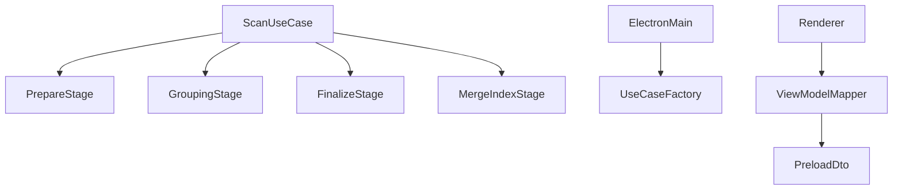

# 05. 스캔 구조 리팩터링과 경계 정리 계획

## 목표
- 거대한 스캔 유스케이스를 단계별 책임으로 분리한다.
- renderer 가 domain/application 구현 세부에 직접 덜 의존하도록 경계를 정리한다.
- preload/shared 계약을 명확히 해 이후 기능 추가 시 파급 범위를 줄인다.

## 현재 상태 요약
핵심 파일:
- [`src/application/usecases/ScanPhotoLibraryUseCase.ts`](C:/workspace/cursor/Photo/src/application/usecases/ScanPhotoLibraryUseCase.ts)
- [`src/presentation/electron/main/index.ts`](C:/workspace/cursor/Photo/src/presentation/electron/main/index.ts)
- [`src/shared/types/preload.ts`](C:/workspace/cursor/Photo/src/shared/types/preload.ts)
- [`src/presentation/electron/preload/api.ts`](C:/workspace/cursor/Photo/src/presentation/electron/preload/api.ts)
- [`src/presentation/renderer/view-models/map/mapPageSelectors.ts`](C:/workspace/cursor/Photo/src/presentation/renderer/view-models/map/mapPageSelectors.ts)
- [`src/presentation/renderer/view-models/flattenLibraryPhotos.ts`](C:/workspace/cursor/Photo/src/presentation/renderer/view-models/flattenLibraryPhotos.ts)
- [`tsconfig.web.json`](C:/workspace/cursor/Photo/tsconfig.web.json)

관찰:
- `ScanPhotoLibraryUseCase.ts` 는 스캔, 이슈 누적, 그룹핑, 복사, 썸네일, 인덱스 병합을 한 파일에 담고 있다.
- 메인 프로세스 조립 코드가 `main/index.ts` 에 집중되어 있다.
- `shared/types/preload.ts` 가 application DTO 와 domain 타입을 함께 끌어온다.
- renderer view-model 이 domain service 를 직접 import 한다.
- `tsconfig.web.json` 은 renderer 컴파일 범위에 domain/application 전체를 포함한다.

## 리팩터링 목표 구조

## 세부 설계

### 1. `ScanPhotoLibraryUseCase` 단계 분리
우선 분리 후보:
- 사진 준비 단계
- 그룹 키/표시명 계산 단계
- 복사/중복/썸네일 finalize 단계
- 인덱스 병합 단계
- issue/result 조립 단계

권장 파일 예시:
- `src/application/services/scan/preparePhotoRecords.ts`
- `src/application/services/scan/finalizePreparedPhotos.ts`
- `src/application/services/scan/buildScanGroupingMaps.ts`
- `src/application/services/scan/buildMergedLibraryIndex.ts`

원칙:
- domain 규칙은 그대로 유지
- use case 는 orchestration 만 담당
- side effect 는 기존 포트를 통해서만 접근

### 2. 입력/출력 모델 분리
현재 `shared/types/preload.ts` 는 preload 브리지와 UI 뷰 모델 계약을 모두 담는다.

정리 방향:
- preload request/response 타입
- renderer view 전용 타입
- application DTO 재-export 최소화

후보 구조:
- `src/shared/types/preload/contracts.ts`
- `src/shared/types/preload/views.ts`

### 3. renderer 의 domain 직접 import 축소
문제 지점:
- [`src/presentation/renderer/view-models/map/mapPageSelectors.ts`](C:/workspace/cursor/Photo/src/presentation/renderer/view-models/map/mapPageSelectors.ts)
- [`src/presentation/renderer/view-models/flattenLibraryPhotos.ts`](C:/workspace/cursor/Photo/src/presentation/renderer/view-models/flattenLibraryPhotos.ts)
- [`src/presentation/renderer/pages/FileListPage.tsx`](C:/workspace/cursor/Photo/src/presentation/renderer/pages/FileListPage.tsx)

현재:
- `stripLeadingDateFromAutoGroupDisplayTitle` 를 domain 에서 직접 가져온다.

정리 방향:
- presentation/common 에 얇은 formatter 또는 mapper 추가
- renderer 는 presentation 계층 유틸만 참조

주의:
- 도메인 규칙을 복제하지 않고 한 곳에서 감싸는 방식이어야 한다.

### 4. Electron 메인 조립 분리
대상:
- [`src/presentation/electron/main/index.ts`](C:/workspace/cursor/Photo/src/presentation/electron/main/index.ts)

분리 후보:
- `createScanPhotoLibraryUseCase`
- `createPreviewPendingOrganizationUseCase`
- `registerIpcHandlers`

권장 구조:
- `main/factories/`
- `main/ipc/registerPhotoAppHandlers.ts`
- `main/window/createMainWindow.ts`

### 5. 컴파일 경계 보강
대상:
- [`tsconfig.web.json`](C:/workspace/cursor/Photo/tsconfig.web.json)

계획:
- 즉시 include 를 바꾸는 것보다, 먼저 renderer 에서 domain/application 직접 import 의존을 줄인다.
- 이후 lint 규칙 또는 tsconfig 조정으로 경계를 강화한다.

## 단계별 작업 순서
1. `ScanPhotoLibraryUseCase` 내부 책임 목록 작성
2. 부작용 없는 계산 로직부터 외부 함수로 추출
3. prepare/finalize/index merge 단계 서비스로 분리
4. renderer 의 domain 직접 import 래퍼 도입
5. preload/shared 계약 분리
6. `main/index.ts` 조립 분리
7. 마지막에 경계 강제 수단 검토

## 비목표
- 도메인 모델 자체 재설계
- DI 프레임워크 도입
- IPC 채널명 전면 변경
- 저장 포맷 대수술

## 테스트 계획

### 유지해야 할 테스트
- [`src/application/usecases/ScanPhotoLibraryUseCase.test.ts`](C:/workspace/cursor/Photo/src/application/usecases/ScanPhotoLibraryUseCase.test.ts)
- [`src/presentation/common/mappers/toLibraryIndexView.test.ts`](C:/workspace/cursor/Photo/src/presentation/common/mappers/toLibraryIndexView.test.ts)
- 관련 view-model 테스트

### 추가할 테스트
- 추출된 스캔 단계 서비스 단위 테스트
- renderer formatter wrapper 테스트
- preload/shared 계약 타입 이동 후 빌드 검증

## 성공 기준
- `ScanPhotoLibraryUseCase` 파일 크기와 책임이 눈에 띄게 줄어든다.
- renderer 가 domain 함수에 직접 의존하는 지점이 감소한다.
- preload/shared 타입 변경 시 영향 범위가 더 예측 가능해진다.
- 메인 프로세스 조립 코드가 use case 별 팩토리/등록 모듈로 나뉜다.

## 리스크와 대응
- 리스크: 리팩터링 범위가 커져 회귀 위험 증가
  - 대응: 단계별 추출 후 테스트를 바로 보강
- 리스크: 과한 추상화
  - 대응: 실제 경계가 있는 곳만 인터페이스/모듈 분리
- 리스크: 타입 이동으로 import churn 증가
  - 대응: 한 번에 전부 옮기지 말고 request/response 계약부터 나눔

## 후속 단계와 연결
- 앞선 1~4단계 성능/UX 개선을 안정적으로 유지하는 기반 작업이다.
- 이후 기능 아이디어를 추가할 때 수정 파일 수를 줄이고 충돌 위험을 낮출 수 있다.
