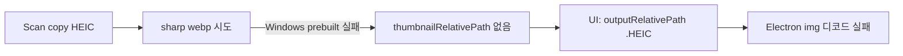

# HEIC 미리보기/썸네일 표시 계획

## 원인

- sharp 프리빌드는 특허 HEVC HEIC 디코드 미지원 → 스캔 시 `thumbnail-generation-failed` 후 경로 없음
- [`FileListPhotoGrid.tsx`](src/presentation/renderer/pages/fileList/FileListPhotoGrid.tsx) 등이 `thumbnail ?? output` 폴백 → `.HEIC`를 `img`에 넣음
- Organize 미리보기는 [`shouldSkipInlinePreviewImage`](src/shared/constants/mediaExtensions.ts)로 HEIC를 아예 스킵

## 접근 (확정)

1. **HEIC 디코더**: `heic-convert`(libheif WASM)로 JPEG 버퍼 변환 후 기존 sharp로 resize/webp
2. **UI**: 표시용 URL은 **webp 썸네일만** (HEIC/HEIF 원본 폴백 금지)
3. **기존 라이브러리**: 그룹 상세 로드 시 누락 썸네일 백필 후 `index.json` 갱신
4. **범위 밖**: HEIC EXIF/GPS (`shouldSkipEmbeddedMetadata`)는 이번엔 유지 — 화면 표시만 해결

## 구현 단계

### 1) HEIC → raster 헬퍼

- 신규: [`src/infrastructure/thumbnails/decodeHeicLikeToJpegBuffer.ts`](src/infrastructure/thumbnails/decodeHeicLikeToJpegBuffer.ts) (가칭)
  - `isHeicLikeLibraryFileName`이면 파일 버퍼 → `heic-convert` → JPEG `Buffer`
  - 아니면 `undefined`(호출측이 sharp 직접 입력)
- [`SharpThumbnailGenerator`](src/infrastructure/thumbnails/SharpThumbnailGenerator.ts): HEIC면 decode 후 `sharp(jpegBuffer)...webp`, 아니면 기존 `sharp(sourcePath)`
- [`SharpPhotoPreviewGenerator`](src/infrastructure/thumbnails/SharpPhotoPreviewGenerator.ts): 동일
- `package.json`에 `heic-convert` 추가; Electron 패키징 시 WASM/native가 막히면 `asarUnpack` 보강 ([`package.json` build.asarUnpack](package.json))

### 2) Organize 미리보기에서 HEIC 스킵 해제

- [`shouldSkipInlinePreviewImage`](src/shared/constants/mediaExtensions.ts): **비디오만** 스킵 (HEIC 제거)
- [`PreviewPendingOrganizationUseCase.createPreviewDataUrlSafely`](src/application/usecases/PreviewPendingOrganizationUseCase.ts)는 그대로 sharp preview 호출 → 새 디코더 경로 사용
- 테스트: [`mediaExtensions.test.ts`](src/shared/constants/mediaExtensions.test.ts), preview use case 기대값 갱신

### 3) UI: HEIC `img` 폴백 제거

- 공통 헬퍼 추가 (예: `resolveLibraryDisplayImageRelativePath(photo)` in [`fileUrl.ts`](src/presentation/renderer/utils/fileUrl.ts) 또는 shared):
  - `thumbnailRelativePath`가 있으면 그것만
  - 없으면 `outputRelativePath`를 쓰되 **HEIC-like면 `undefined`**
- 적용:
  - [`FileListPhotoGrid.tsx`](src/presentation/renderer/pages/fileList/FileListPhotoGrid.tsx)
  - [`useFileListPathAndRows.ts`](src/presentation/renderer/pages/fileList/useFileListPathAndRows.ts)
  - [`GroupPhotoGrid.tsx`](src/presentation/renderer/components/map/GroupPhotoGrid.tsx)
  - [`MapPhotoPreviewOverlay.tsx`](src/presentation/renderer/components/map/MapPhotoPreviewOverlay.tsx)
  - [`photoGroupMapMarkerDom.ts`](src/presentation/renderer/components/map/photoGroupMap/photoGroupMapMarkerDom.ts)
  - [`GroupPreviewCard.tsx`](src/presentation/renderer/components/map/GroupPreviewCard.tsx) (해당 시)
- 썸네일 없을 때는 깨진 아이콘 대신 플레이스홀더(“미리보기 없음”)

### 4) 기존 HEIC 백필

- 서비스: `ensureMissingPhotoThumbnails` — `thumbnailRelativePath` 없고 비디오가 아닌 photo에 대해 `outputRoot + outputRelativePath`로 `thumbnailGenerator.generateForPhoto` 호출, 상대경로 기록, 그룹 representative thumb 갱신, `libraryIndexStore.save`
- 호출: [`LoadLibraryGroupDetailUseCase`](src/application/usecases/LoadLibraryGroupDetailUseCase.ts) — 파일 목록/지도가 그룹을 열 때 해당 그룹(또는 상세에 포함된) 사진만 처리 → 사용자가 본 화면부터 복구
- 팩토리 [`createPhotoAppUseCases.ts`](src/presentation/electron/main/factories/createPhotoAppUseCases.ts)에 thumbnailGenerator + thumbnails 루트 주입
- 동시성 제한(예: 2)으로 WASM CPU 스파이크 완화

### 5) 검증

- 단위: HEIC 파일명일 때 preview skip 해제, display path 헬퍼가 HEIC 폴백 안 함, 백필이 `thumbnailRelativePath`를 채움(mock generator)
- 수동: 스크린샷의 `busan` HEIC 그룹 재진입 → webp 생성·그리드/우측 미리보기 표시; Organize 미리보기에 HEIC 썸네일 등장

## 주요 변경 파일

- [`SharpThumbnailGenerator.ts`](src/infrastructure/thumbnails/SharpThumbnailGenerator.ts) / [`SharpPhotoPreviewGenerator.ts`](src/infrastructure/thumbnails/SharpPhotoPreviewGenerator.ts)
- [`mediaExtensions.ts`](src/shared/constants/mediaExtensions.ts)
- 표시 URL 헬퍼 + 파일목록/지도 UI 몇 곳
- [`LoadLibraryGroupDetailUseCase.ts`](src/application/usecases/LoadLibraryGroupDetailUseCase.ts) + create factory
- `package.json` (dependency / asarUnpack)
